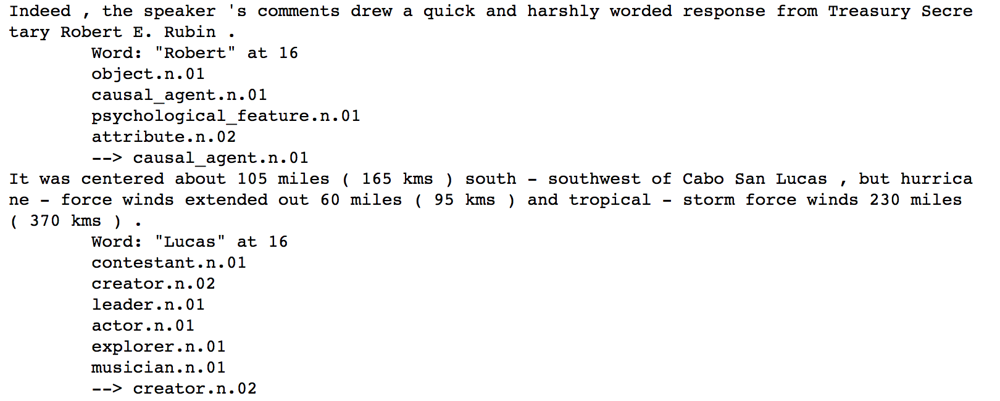

## Experiments with highest-disambiguating nodes (HDNs)

I limit to words that have only one sense in all parts-of-speech so that we
don't need to POS-tag the corpus.

I ignore proper names because they might refer to different entities than what
are in WordNet and can be embedded as part of other names (see
screenshot below).

**Masking**: because the list of HDNs contain synsets in many different layers,
some have hypernym-hyponym relationship with each other, it is incorrect to 
compute softmax over the whole HDN vocabulary. A lemma only provides evidence
about a particular sublist of HDNs and we need to use a mask to hide everything
else before running softmax.  